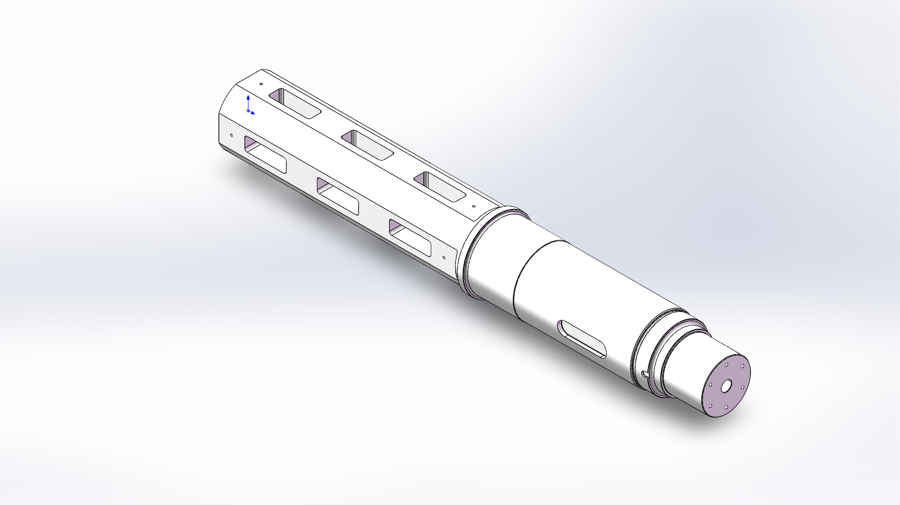
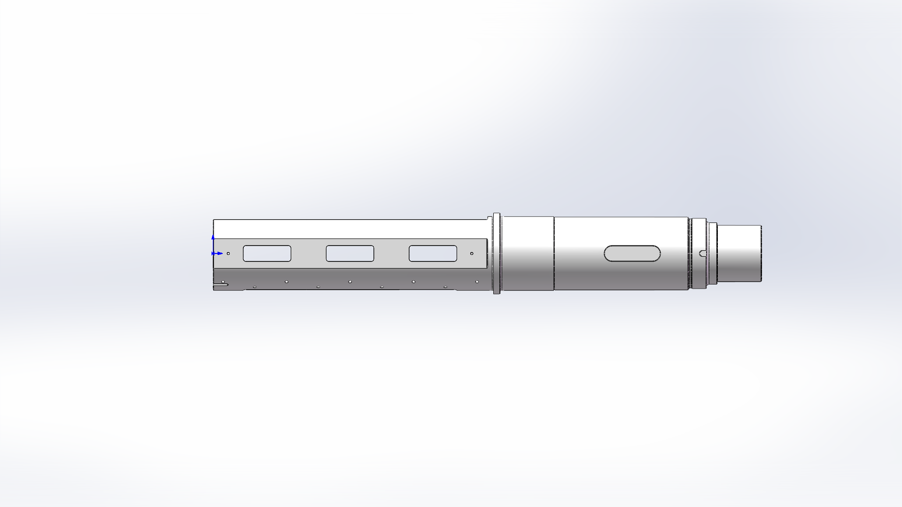
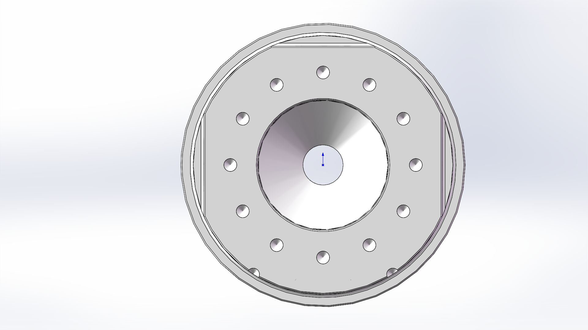
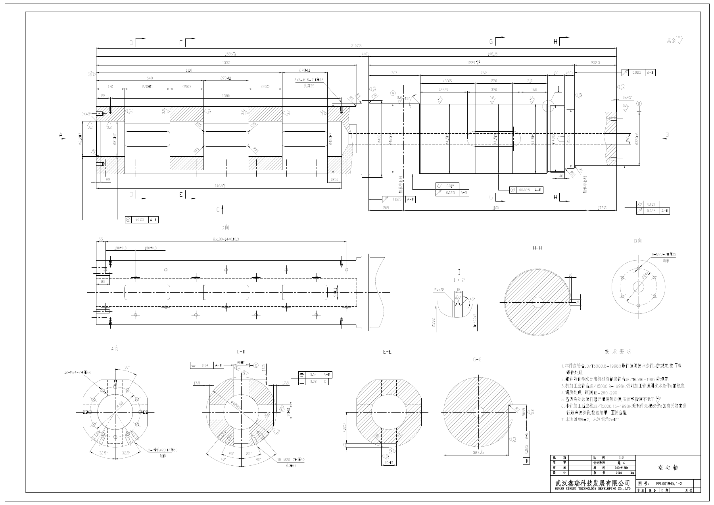

# Auto SolidWorks

**简体中文** | [English](README.en.md)

在本机 SolidWorks 中，通过自然语言或工程图创建和修改参数化零件、装配体，并保存原生模型与 STEP/STL。

**Windows · 本机 SolidWorks · 默认 mm · 9 个 MCP 工具**

[下载 Windows 插件](docs/download.zh-CN.md) · [安装说明](docs/installation.md) · [从源码构建](docs/development.md) · [功能参数](plugins/auto-solidworks/skills/auto-solidworks/references/modeling-operations.md)

## 测试案例：空心轴

**PPL001M45.1-2 空心轴**：以多视图工程图为输入的复杂轴类零件建模案例，展示阶梯轴段、侧面长窗口、键槽、环槽及端面孔组等结构。

<table>
<tr>
<td align="center" width="33%"><a href="docs/examples/hollow-shaft/model-preview.png"></a><br><sub>等轴视图</sub></td>
<td align="center" width="33%"><a href="docs/examples/hollow-shaft/model-side.png"></a><br><sub>侧向视图</sub></td>
<td align="center" width="33%"><a href="docs/examples/hollow-shaft/model-end.png"></a><br><sub>端面视图</sub></td>
</tr>
</table>

点击缩略图查看原始大图。

[查看案例说明](docs/examples/hollow-shaft/README.md) · [查看原始 PDF 图纸](docs/examples/hollow-shaft/drawing.pdf)

<details>
<summary>展开查看输入工程图</summary>



完整尺寸与技术要求请打开上方 PDF。

</details>

本案例展示提供的图纸与模型效果；截图不作为全部尺寸、公差和图纸等价性已通过验证的证明。

## 快速开始

1. 安装并激活本机 SolidWorks，安装 **.NET 9 Windows Desktop Runtime（x64）** 和支持插件的 Codex CLI。
2. 从[下载页面](docs/download.zh-CN.md)下载 `auto-solidworks-0.5.4-windows-x64.zip`，解压到一个长期保留的目录。
3. 在解压目录打开 PowerShell，运行：

   ```powershell
   powershell -NoProfile -ExecutionPolicy Bypass -File .\install.ps1
   ```

4. 在 Codex 新任务中选择 **Auto SolidWorks**，描述尺寸或提供图纸：

   > 创建一个 80 × 50 × 10 mm 的矩形板，中心有一个直径 10 mm 的通孔，保存 SLDPRT 和 STEP。

安装脚本从你的本机 SolidWorks 安装目录读取 interop 组件，再注册本地插件源。插件包不分发 SolidWorks 程序或 interop DLL。安装路径无法自动发现时，使用 `-SolidWorksInteropDir`，见[安装说明](docs/installation.md)。

GitHub 自动提供的 **Source code (zip)** 是源码，未包含编译后的运行程序。源码用户先执行构建步骤。直接把本仓库添加为远程插件源也不会自动下载运行程序；普通用户请使用 Release ZIP。

## 能做什么

| 范围 | 功能 |
|---|---|
| 草图 | 矩形、圆、圆弧、多边形、槽、椭圆、样条、约束与驱动尺寸 |
| 零件 | 拉伸、切除、旋转、孔、圆角、倒角、抽壳、拔模、肋、放样与扫描 |
| 重复与多实体 | 阵列、镜像、布尔运算、分割、移动与复制 |
| 钣金、焊件、曲面 | 基体与法兰、展开、型材构件与裁剪、曲面与加厚 |
| 装配 | 插入零部件、配置与位姿、几何配合、干涉检查 |
| 检查与修改 | 特征、尺寸、配置、实体几何、原生零件副本修改、STEP 导入检查 |
| 图纸输入 | 本地图片与 PDF、OCR 候选、分区/旋转提示、尺寸绑定检查 |
| 文件输出 | SLDPRT、SLDASM、STEP/STP、STL、SLDDRW、PDF |

工具流程：`cad_get_capabilities → cad_read_drawing（有图时）→ cad_create_model_plan → cad_build_model → cad_inspect_model`。

装配、型材与连接诊断分别使用 `cad_build_assembly`、`cad_list_weldment_profiles`、`cad_executor_health`。计划直接传递 typed draft / IR；`dryRun` 可选，默认建模执行。不会通过任意 shell 或脚本执行接口操作 CAD。

`cad_export_drawing` 可从已保存零件导出第一角法 A3 原生工程图和 PDF，包含四视图、原生尺寸与参数表。导出后重新打开检查纸页与模型引用，并核对源模型哈希。当前最多支持 44 个源参数；复杂图纸可能仍需人工整理标注。

0.5.4 同时包含来源尺寸绑定、局部几何检查、检查点恢复与倒角参数修复。详见[版本验证](docs/validation.md)。

## 运行方式与范围

- CAD 执行、图纸预处理与文件保存在本机进行。Codex 或其他 AI 客户端如何处理提示、图纸和模型提供商请求，取决于该客户端及其设置；本项目不把云端 AI 会话描述为完全离线。
- 未声明单位时使用 mm。关键尺寸缺失或冲突时需要澄清；OCR 数字需要结合原图判断。
- `cad_executor_health` 和实际建模可能启动 SolidWorks。默认创建新文件，不覆盖已有模型。
- 当前版本未生成物理螺旋螺纹，也不完整解释任意 GD&T。Tapped 孔使用底孔和原生装饰螺纹。
- 功能族不代表支持其中每一种 SolidWorks 选项。几何创建、重建和测量成功不能自动证明与任意工程图等价。
- 本机开发验证使用 SolidWorks 2025；其他版本需要自行验证。此次公开发布的检查范围见[发布验证](docs/validation.md)。

## 开发与反馈

源码位于 `src/`，插件内容位于 `plugins/auto-solidworks/`。构建、非 CAD 烟雾检查和原生测试见[开发说明](docs/development.md)。报告问题时请附上插件版本、SolidWorks 版本、最小尺寸描述和错误信息。

## 许可证

项目源码采用 [MIT License](LICENSE)。第三方组件适用各自许可证，见 [THIRD_PARTY_NOTICES.md](THIRD_PARTY_NOTICES.md)。SolidWorks 是外部专有依赖，需要使用者自己的安装与许可。本项目独立开发，不代表 Dassault Systèmes 或 SOLIDWORKS 官方。
