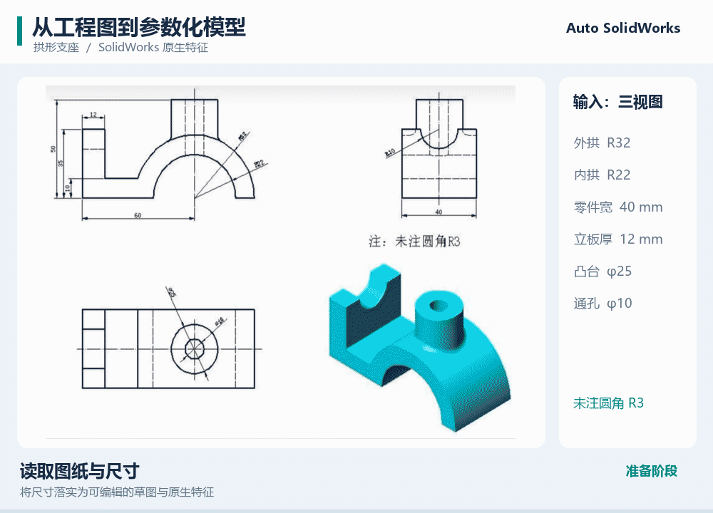
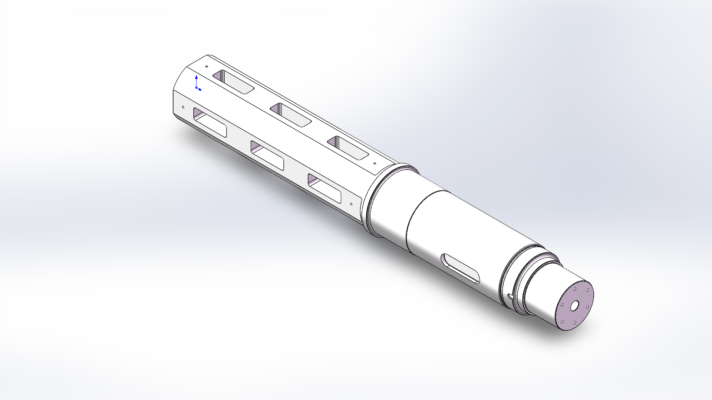

# Auto SolidWorks

**把工程图与尺寸描述转成可编辑的 SolidWorks 参数化模型。**

Auto SolidWorks 是面向 Codex / MCP 的本地 CAD 插件：在你的 SolidWorks 中创建、检查和修改零件与装配体，输出原生模型、STEP / STL 和工程图；曲线网格可交给本地 Gordon 工具生成 NURBS 曲面。

**简体中文** | [English](README.en.md)

**版本 `26.10.07`· Windows x64 · 18 个 MCP 工具 **

[下载 Windows 插件](docs/download.zh-CN.md) · [本次新增内容](docs/release-26.10.07.zh-CN.md) · [GitHub Release](https://github.com/qdaia/Auto-SolidWorks/releases/tag/v26.10.07) · [从源码构建](docs/development.md)

## 从输入到交付

提供工程图片、PDF 或明确尺寸，插件将输入整理为可检查的建模计划，再通过本机 SolidWorks 执行。你可以继续修改驱动尺寸，检查几何与装配关系，并保存可编辑的原生文件。

| 工作内容 | 提供的能力与输出 |
| --- | --- |
| 参数化零件 | 草图与约束、拉伸、旋转、孔、圆角倒角、扫描、放样、阵列、多实体、钣金和焊件；SLDPRT / STEP / STL |
| 曲面与空间曲线 | Boundary / Fill / Sweep / Offset 的类型化控制、三维曲线与螺旋线；本地 Gordon 曲线网格与 NURBS 文件 |
| 设计参数 | 全局变量、尺寸方程、配置表达式、单位检查、特征抑制及保存后的读回 |
| 既有模型 | 副本修改、持久引用、局部及整件几何检查、限定范围的拓扑历史与修复回执 |
| 装配体 | 组件、配合、干涉检查、限定空间树机构自由度检查；SLDASM |
| 工程图 | 第一角投影视图、原生尺寸导入、视图布局与分页；SLDDRW / PDF |
| 执行管理 | 状态查询、暂停、截止时间、跨进程租约、检查点与恢复身份核对 |

## 2026 年 10 月 7 日新增（版本 `26.10.07`）

- 中文设计树与工程图默认文本，以及本地 Gordon 曲面生成。
- 高级放样与三维曲线控制、曲面定义读回、配置方程和特征抑制。
- 持久几何历史、完整样条与球面修订检查、名义实体螺纹和空间树机构检查。
- 装配工程图尺寸读回、分页布局、执行状态与暂停工具、桌面版 Codex 安装支持。

完整条目见[中文更新说明](docs/release-26.10.07.zh-CN.md)。

## 测试案例

### 拱形支座：建模过程

根据三视图与尺寸创建拱形底座、立板、圆柱凸台、通孔、半圆槽和 R3 圆角。

<p>
<a href="docs/examples/arch-support/modeling-process.gif"></a>
</p>

动画按本次生成模型的原生特征树顺序回放，时长约 16 秒；不是实时操作录像。最终模型已通过重建、保存重开与 STEP 导出回读检查。

### 空心轴

**PPL001M45.1-2 空心轴**：以多视图工程图为输入的复杂轴类零件建模案例，展示阶梯轴段、侧面长窗口、键槽、环槽及端面孔组等结构。

<p>
<a href="docs/examples/hollow-shaft/model-preview.png"></a>
</p>

点击缩略图查看原始大图。

[查看案例说明](docs/examples/hollow-shaft/README.md) · [查看原始 PDF 图纸](docs/examples/hollow-shaft/drawing.pdf)

<details>
<summary>展开查看输入工程图</summary>


完整尺寸与技术要求请打开上方 PDF。

</details>

本案例展示提供的图纸与模型效果；截图不作为全部尺寸、公差和图纸等价性已通过验证的证明。

## 快速开始

1. 准备 Windows x64、已激活的本机 SolidWorks、[.NET 9 Windows Desktop Runtime x64](https://dotnet.microsoft.com/en-us/download/dotnet/9.0)，以及支持插件的 Codex。
2. 下载并解压 [26.10.07 Windows 安装包](https://github.com/qdaia/Auto-SolidWorks/releases/download/v26.10.07/auto-solidworks-26.10.07-windows-x64.zip)，在解压目录运行：

   ```powershell
   powershell -NoProfile -ExecutionPolicy Bypass -File .\install.ps1
   ```

3. 打开新的 Codex 聊天，启用 **Auto SolidWorks**，给出尺寸或工程图：

   > 创建一个 80 × 50 × 10 mm 的矩形安装板，中心有直径 10 mm 的通孔，四角做 R2 圆角，保存 SLDPRT 和 STEP。

安装器优先使用 Codex 桌面版自带 CLI，并从本机 SolidWorks 安装目录准备 Interop。详细步骤及自定义目录见[中文下载与安装说明](docs/download.zh-CN.md)。

## 本地运行与能力查询

CAD 执行、原生文件和几何检查在本机完成。SolidWorks 由使用者安装并授权；Gordon 另需本地 FreeCAD。图片 / PDF 的理解使用你选择的模型与服务，OCR 和 PDF 栅格化依赖可按需配置。

<!-- AUTO-SOLIDWORKS-CONTRACT:BEGIN -->
版本：`26.10.07`。通过 `cad_get_capabilities` 查询当前功能、输入约束和验证范围，或阅读[随包能力清单](plugins/auto-solidworks/skills/auto-solidworks/references/capability-manifest.json)。本版完成重新构建、1,101 项离线检查及安装后的 128 项公开接口检查；原生案例证据按其原始修订记录。
<!-- Capability manifest SHA256: 04e0dc6afa7d8b14dc5ebde410f73c1ae0b050afaacbde725a504d9aec910ac1 -->
<!-- AUTO-SOLIDWORKS-CONTRACT:END -->

[功能参数](plugins/auto-solidworks/skills/auto-solidworks/references/modeling-operations.md) · [Gordon 使用](plugins/auto-solidworks/skills/auto-solidworks/references/gordon-surface.md) · [曲面控制](plugins/auto-solidworks/skills/auto-solidworks/references/surface-modeling.md) · [几何验证](plugins/auto-solidworks/skills/auto-solidworks/references/local-geometry-verification.md)

## 开发与反馈

[源码构建与测试](docs/development.md) · [架构说明](docs/architecture.md) · [第三方声明](THIRD_PARTY_NOTICES.md) · [提交问题](https://github.com/qdaia/Auto-SolidWorks/issues)

项目使用 MIT 许可证，见 [LICENSE](LICENSE)。SolidWorks、FreeCAD 及其他第三方组件遵循各自的授权与许可。
